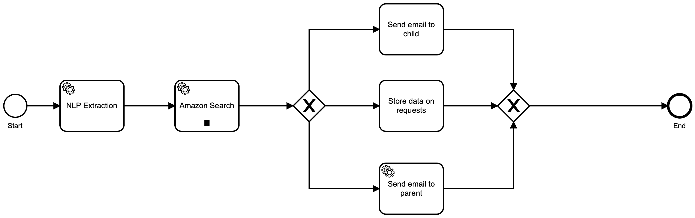

# Letters to Santa - Automating Joy to the World, At Scale

It’s that time of year again. The time when the world’s largest order fulfillment operation experiences its heaviest load. No, not Amazon - we’re talking about Santa Claus, Inc. - the largest logistics company in the world, with a 24-hour global delivery window at peak load.

This year is different, however. Earlier this year, Saint Nick clicked on an ad on his Facebook feed, one promising a digital nomad lifestyle through automating his business. Sick of the Arctic weather and the stress of traveling, the thought of sitting on a beach in Thailand - while still bringing joy to children around the world - was enticing.

Santa paid for the course, and applied the principles of process automation, task decomposition and distribution, and integration with third-party services to his business.

Now, children’s letters to Santa are routed to independent associates (their parents), who fulfill the orders using Amazon. Santa’s successful business transformation became a case study, which we’re going to share with you here.

Before we get into that, let’s answer the obvious first question: what happened to the elves and the reindeer?

Obviously, they were concerned about their future. I mean, their entire industry just got innovated out of existence overnight. Union officials met with Santa, and after an undisclosed settlement, the elves launched a new start-up: Elvenware, working on a suite of productivity tools; and the reindeer are doing a celebrity tour, with a show being developed for a Vegas residency.

Now, Saint Nick is kicking back on a beach on Koh Samui, while the automation brings joy to the world - at scale.

Here’s how it’s done.

## The Front End

Given that Santa's a modern guy, and in case he needed to supplement his retirement income with some contract front-end development work, Santa decided to do a crash course in learning to program in React.js. It seemed like the thing all the cool kids were doing, so Santa wanted to give it a shot.

While it was harder than he thought, thanks to a lot of hard-core googling, and a lot of copy-paste (remember kids, good developers copy, great developers paste!) he was able to come up with a site that at least looks passable, and handles the simple function of accepting a letter to Santa and submitting it to the process engine.

For the process engine Santa of course chose [Camunda](https://camunda.com) because of course he did!

Once the form was designed, all that was left to do was submit the form using some JavaScript:

```javascript
const handleSubmit = event => {
    event.preventDefault();
    setSubmitting(true);
    if (!event.target.checkValidity()) {
      // form is invalid! so we do nothing
      return;
    }
    const requestOptions = {
      method: 'POST',
      headers: { 'Content-Type': 'application/x-www-form-urlencoded;charset=UTF-8' },
      body: JSON.stringify(formData)
    };
    fetch('https://write-a-letter-to-santa.org:9091/santa', requestOptions);

    alert('Santa has been notified! You can reload the page to send another letter.');
  }
  ```
Using a simple alert to let the user know that the form was submitted was the path of least resistance, and Santa was getting lazy.

## The Process

Handling a letter by just forwarding it to the parents as-is seemed a little too lazy, even for Santa, so he quickly designed a business process using [Cawemo](https://cawemo.com) to handle the routing of the letters.

Here's what that process looks like:



And here's the flow:

1) A letter comes in, which starts the process
2) The letter is analyzed using some Natural Language Processing (NLP) algorithms to extract some parts of the letter to help figure out what the writer is asking for:
   1) Identify any items the writer is asking for
   2) Do some Sentiment Analysis to try to figure out how important each item is to the writer.
3) Once this is done, Go find some possible Amazon links for the things identified
4) Send a letter to the parents with a copy of the original letter, the items they asked for (linked to Amazon of course) and some helpful hints as to what the writer wanted most.
5) Store the product information in a local database for analysis later.

Now, before anyone tries to have Santa fined for non-compliance with GDPR, he's not storing any names, email addresses, or any other personal data. Santa already knows all about you! He just stores the items asked for. So he can do some demand-gen analysis later. Of course.

Santa wrote a pretty basic web-server in `Go` to handle the incoming letters, and submit them to the Camunda BPM processing engine:

```go
http.HandleFunc("/santa", santa)
	err := http.ListenAndServe(":9091", nil) // set listen port
	if err != nil {
		log.Fatal("ListenAndServe: ", err)
  }
```
And then a handler function:

```go
func santa(w http.ResponseWriter, r *http.Request) {
	enableCors(&w)
	if r.Method == "GET" {
		log.Println("GET Method Not Supported")
		http.Error(w, "GET Method not supported", 400)
	} else {
		body, err := ioutil.ReadAll(r.Body)
		if err != nil {
			panic(err)
		}
		log.Println(string(body))
		var t SantaData
		err = json.Unmarshal(body, &t)
		if err != nil {
			panic(err)
		}
		log.Println(t.Letter)
		w.WriteHeader(200)
		client := camundaclientgo.NewClient(camundaclientgo.ClientOptions{
			EndpointUrl: "http://localhost:8000/engine-rest",
			ApiUser:     "demo",
			ApiPassword: "demo",
			Timeout:     time.Second * 10,
		})

		processKey := "santa"
		variables := map[string]camundaclientgo.Variable{
			"name":   {Value: t.Name, Type: "string"},
			"email":  {Value: t.ParentEmailAddress, Type: "string"},
			"letter": {Value: t.Letter, Type: "string"},
		}
		_, err = client.ProcessDefinition.StartInstance(
			camundaclientgo.QueryProcessDefinitionBy{Key: &processKey},
			camundaclientgo.ReqStartInstance{Variables: &variables},
		)
		if err != nil {
			log.Printf("Error starting process: %s\n", err)
			return
		}
	}
}
```
He did have to enable CORS to allow the cross-origin posting of data. That's rather a key point in all of this since the server here runs on a different port than the server that handles posting the letters.

After that, a bit of magic with the [Camunda Go Client](https://github.com/citilinkru/camunda-client-go) and the letter is submitted to the Camunda BPM Process Engine.

## Natural Language Processing?

Yes, it's a form of Artificial Intelligence (AI) that allows you to break up written text and identify parts of it based on certain criteria. Done right, it can be very accurate.

So let's take a sample letter:

> Dear Santa,
>
> My name is Leon and I'm 36 years old (yeah, I still believe in Santa 😇)
>
> This year I've been the goodest kid ever, so I kinda deserve a big present...
>
> I was thinking about a nice LEGO box like the skyline kit or the New York City one. If that's not an option, I'd settle for some good chocolate too!
>
> Thank you,
> Leon

Now you and I can easily pick out the `items` in that letter that would be gifts, but it turns out that doing that is harder than it seems.

When we run that through our NLP processor we get:

```
This year I've been the goodest kid ever, so I kinda deserve a big present...
Sentiment: 0.300000, positive	Item: name	 Type: OTHER
Sentence: I was thinking about a nice LEGO box like the skyline kit or the New York City one.
Sentiment: 0.200000, positive	Item: LEGO box	 Type: OTHER
Item: skyline kit	 Type: OTHER
Sentence: If that's not an option, I'd settle for some good chocolate too!
Sentiment: 0.700000, positive	Item: option	 Type: OTHER
Item: chocolate	 Type: OTHER
Sentence: Thank you,
Leon
Sentiment: 0.800000, positive
```
Hmmm ... Not great.

If Leon had written Santa a more specific letter, we could have gotten some better results for him:

> Dear Santa,
>
> My name is Leon and I'm 36 years old (yeah, I still believe in Santa 😇)
>
> This year I've been the goodest kid ever, so I kinda deserve a big present...
>
> I was thinking about a nice Lego skyline kit or the Lego New York City Skyline Kit.
>
> If that's not an option, I'd settle for some good Belgian Chocolate too!
>
> Thank you,
> Leon

When we process that letter, we get better results:

```
Letter is 4 sentences long.
Sentence: Dear Santa, My name is Leon and I'm 36 years old (yeah, I still believe in Santa :innocent:) This year I've been the goodest kid ever, so I kinda deserve a big present...
Sentiment: 0.500000, positive	Item: name	 Type: OTHER
Item: Santa	 Type: OTHER
Sentence: I was thinking about a nice Lego skyline kit or the Lego New York City Skyline Kit.
Sentiment: 0.000000, positive	Item: skyline kit	 Type: OTHER
Item: Lego	 Type: ORGANIZATION
Item: Skyline Kit	 Type: CONSUMER_GOOD
Sentence: If that's not an option, I'd settle for some good Belgian Chocolate too!
Sentiment: 0.400000, positive	Item: option	 Type: OTHER
Item: Belgian Chocolate	 Type: CONSUMER_GOOD
Sentence: Thank you, Leon
Sentiment: 0.800000, positive
```

You'll notice that now we have identified some `CONSUMER_GOODS` in the letter, which are _much_ easier to find.

So let's see how Santa went about finding links.

## Finding Links

Being Santa, and having an entire _year_ to plan for this, you would have thought Santa could have been better prepared, but, well, the retirement decision was sort of last-minute, and the beach in Thailand was sooo nice, he sort of forgot a few details.

The main detail he forgot was to create an Amazon Seller Account, which would have given him access to the product search API. With that, he could have done a much better job of searching for products, looking at the results, etc.

This was not the case, alas. But thankfully one of Santa's smarter elves stepped up at the last possible minute and told him to just use an Amazon search URL. Next year, Santa will be more prepared for this.

## Sending the Email

Since Santa didn't really want to do, well, much of anything, even the email portion was automated.

He took all the information gathered in the previous steps, and pulled it all together into a nice email to the Parents:

> Seasons Greetings!
>
> Guess what? Leon has written me a letter asking for a few things. As I've now retired to a beach in Thailand, I thought maybe you'd like to know what Lean asked for. Here's the letter:

> > "Dear Santa,
> >
> > My name is Leon and I'm 36 years old (yeah, I still believe in Santa 😇)
> >
> > This year I've been the goodest kid ever, so I kinda deserve a big present...
> >
> > I was thinking about a nice Lego skyline kit or the Lego New York City Skyline Kit.
> >
> > If that's not an option, I'd settle for some good Belgian Chocolate too!
> >
> > Thank you,
> > Leon"
>
> I've taken the liberty of figuring out which things they want most, and provided you with a list so that you can just purchase these items directly. I know, it's put the elves out of work, but they're a resourceful lot and will undoubtedly figure out something to do with themselves. And no, they are not available for purchase.
>
> So, that list:

> name ‼️
> Santa ‼️
> skyline kit ⁉️
> Lego ⁉️
> Skyline Kit ⁉️
> option ❗️
> Belgian Chocolate ❗️
>
> In case you're wondering, since I'm retired, I'm also lazy. So I've used some Artificial Intelligence (which really isn't all that intelligent) to sort of 'rate' what they asked for. I _could_ have ordered the list, but as I just told you, I'm retired, and lazy. Here's the rating system:
>
> - ⚠️: meh.
> - ⁉️: Ok, I guess.
> - ❗: Now we're talkin!
> - ‼️: Oh please! Oh Please! Oh please!
>
> All the best from me and Mrs. Claus
>
> --
> PS: Please don't write back to this email address. I'm retired!
>
> [Write your own letter!](https://write-a-letter-to-santa.org)

Santa was now done. And he didn't have to lift a finger!

## How did he do it all?

It did take writing some code, but Santa was able to keep using the Camunda Golang client library to handle everything.

As we saw, once the letter was submitted, the web server created a new task in Camunda and submitted it, along with all the process variables it needed to keep track of (to start with, just the `name`, `email address` and the `letter` itself). We've already seen how that was done.

But once that was submitted as a task, how was that task handled?

## Handling a task

This is the technical bit. In that same Go process that handles the incoming letters (though it could have been in a completely separate process), we listen for new tasks on the `santa` queue. Specifically, we first listen for `nlp-extraction` tasks.

First, we have to create a client for the Camunda BPM engine:

```go
client := camundaclientgo.NewClient(camundaclientgo.ClientOptions{
		EndpointUrl: "http://hostname:8080/engine-rest",
		// ApiUser:     "demo",
		// ApiPassword: "demo",
		Timeout: time.Second * 10,
	})
	logger := func(err error) {
		fmt.Println(err.Error())
  }
  ```
Once we have the client, we can begin to create some processes that watch the various task queues. So for the NLP queue:

```go
proc := processor.NewProcessor(client, &processor.ProcessorOptions{
		WorkerId:                  "nlpProcessor",
		LockDuration:              time.Second * 10,
		MaxTasks:                  10,
		MaxParallelTaskPerHandler: 100,
		LongPollingTimeout:        10 * time.Second,
	}, logger)
	// NLP Handler
	proc.AddHandler(
		&[]camundaclientgo.QueryFetchAndLockTopic{
			{TopicName: "nlp-extraction"},
		},
		func(ctx *processor.Context) error {
			fmt.Printf("Running task %s. WorkerId: %s. TopicName: %s\n", ctx.Task.Id, ctx.Task.WorkerId, ctx.Task.TopicName)
			var sentRes camundaclientgo.Variable
			var err error
			varb := ctx.Task.Variables
			text := fmt.Sprintf("%v", varb["letter"].Value)
			fmt.Println(text)
			sentRes, err = analyze(text) // <-- **this is the important bit
			if err != nil {
				log.Fatal(err)
			}
			vars := make(map[string]camundaclientgo.Variable)
			vars["status"] = camundaclientgo.Variable{Value: "true", Type: "boolean"}
			vars["gifts"] = sentRes
			err = ctx.Complete(processor.QueryComplete{
				Variables: &vars,
			})
			if err != nil {
				fmt.Printf("Error set complete task %s: %s\n", ctx.Task.Id, err)
			}
			fmt.Printf("Task %s completed\n", ctx.Task.Id)
			return nil
		},
	)
  ```
  This process creation process is also provided by the [Go Client](https://github.com/citilinkru/camunda-client-go/processor).

  The process is created, using the `client` created previously, and telling the process what tasks to listen for, how long to lock the task (so no one else tries to claim and process it) and then what to **do** once the task is claimed. A Camunda Client `Variable` object is created, and then the `analyze()` function is called.

  The analysis function returns the `Variable` which has been filled out with all the parts identified. Those are all stored in a JSON object (represented by a `struct` in Go)

  ```go
  type Gift []struct {
	Gifts      []string `json:"gift"`
	Types      []string `json:"type"`
	Sentiments []int    `json:"sentiment"`
	Amazon     []string `json:"amazon"`
}
```
After the `analyze` function completes, the `Gifts`, `Types` and `Sentiments` are all filled out, but the `Amazon` portion is empty because we haven't done that yet.

Since we've completed the analysis of the letter, we take all the results, package them up into some new variables, and put everything back into the Camunda BPM engine.

Of course, the next step is to create a similar process to watch for tasks on the `amazon-search` queue. The process is really identical to the previous one, except that it listens for different task identifiers, and calls a different method to execute on the instance variables.

Once the `amazon-search` task is completed (and the `Amazon` portion of the data structure is filled in for each `Gift` idea), the whole thing is returned to the Camunda BPM and the task is marked as completed.

Which moves it on to the `email` portion.

Again, a `processor` is defined to listen for `email` tasks, claim them, and then compose and sent the email to the recipient. Once this is done, the task is marked as completed, and returned.

Finally, we have a task that stores all the `Gifts` in a database so that Santa can see what sorts of gifts people asked for this year. He may be retired, but still needs to keep a finger on the pulse of what kids want!

## Work Flow Completion

This entire workflow is extremely efficient. It generally completes in a few seconds at most. It's so fast, in fact, that Santa can't even see any processes sitting around in Cockpit! Unless there's a problem. Which there won't be, because Santa doesn't want to be disturbed.

## Areas for improvement

Of course the NLP part could be improved substantially. Santa simply used the free-tier of Google's Natural Language Processing engine, with zero adjustments, and took the results without any further analysis. (Need I remind you of Santa's laziness at this point?).

Further, the Amazon search portion could be _much_ better with an actual Amazon Reseller account. Maybe next year.

If you can think of other areas for improvement -- and there must be a lot! -- please feel free to reach out to [David G. Simmons](mailto:david.simmons@camunda.com), Principal Developer Advocate at Camunda who was responsible for helping Santa get this entire process set up.
